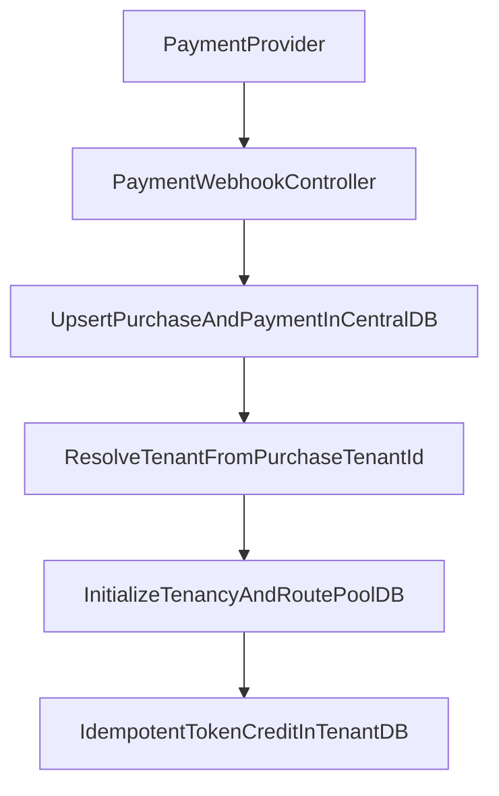

# ADR-0002: Central payments + tenant tokens in pooled DBs

## Status

Accepted.

## Context

- The system uses **subdomain-based tenancy** with **pooled tenant DBs**.
- Each user maps **1:1** to a tenant (`tenants.id`), but **many tenants share the same
  physical pool DB** (e.g. `tenant_pool_1`, `tenant_pool_2`).
- Webhooks from payment providers arrive on **central domains** and cannot rely on tenant
  subdomains or tenant headers.
- Tokens must be credited **per tenant** (effectively per user in 1:1 tenancy).
- Cross-DB foreign keys are not allowed (central ↔ tenant pools).

## Decision

### Data placement

- **Central DB**
  - `purchases` (includes `tenant_id` + `user_id`)
  - `payments` (links to `purchase_id` only; **no `user_id`**)
  - `payment_events` (raw provider webhook events; unique `provider_event_id`)
  - `subscriptions` (central billing state)

- **Tenant DB (pooled)**
- `token_wallets` (one row per `tenant_id`, `user_id` matches the tenant’s central user)
  - `token_transactions` (append-only ledger; idempotent by provider transaction id)

### Webhook flow

1. Receive webhook on the **central domain** and verify signature (if configured).
2. Upsert `payment_events` (idempotency by `provider_event_id`).
3. Upsert `payments` + update `purchases.status` in **central DB**.
4. Resolve tenant by **`purchase.tenant_id`** (fallback: derive by `purchase.user_id`).
5. **Asynchronously** credit tokens in tenant DB:
   - Dispatch `CreditTokensForPayment` job.
   - Insert `token_transactions` with unique `(tenant_id, provider_transaction_id)`.
   - Increment `token_wallets.balance` if the transaction is new.

### Idempotency contract

- Webhooks can retry; token credit must not double-apply.
- Idempotency keys:
  - `provider_event_id` (central `payment_events`)
  - `provider_transaction_id` scoped by `tenant_id` (tenant `token_transactions`)

## Consequences

- **No cross-DB foreign keys** between `token_transactions` and central `payments/purchases`.
- Central `purchases.tenant_id` becomes the **routing key** for tenant crediting.
- Token credit happens **only on successful payment** (not on creation).
- Missing token amount results in **no credit** (webhook still recorded).
- Credit runs on the queue (sync or async depending on queue driver).

## Flow diagram

## Implementation pointers

- Webhook handler: `backend/app/Http/Controllers/Webhook/PaymentWebhookController.php`
- Central migrations: `backend/database/migrations/2026_01_28_000001_create_purchases_table.php`,
  `backend/database/migrations/2026_01_28_000002_create_payments_table.php`,
  `backend/database/migrations/2026_01_28_000003_create_payment_events_table.php`
- Tenant migrations: `backend/database/migrations/tenant/2026_01_28_100009_create_token_wallets_table.php`,
  `backend/database/migrations/tenant/2026_01_28_100010_create_token_transactions_table.php`
- Credit job: `backend/app/Jobs/CreditTokensForPayment.php`
- Tenancy bootstrapper: `backend/app/Tenancy/Bootstrappers/DatabasePoolTenancyBootstrapper.php`
