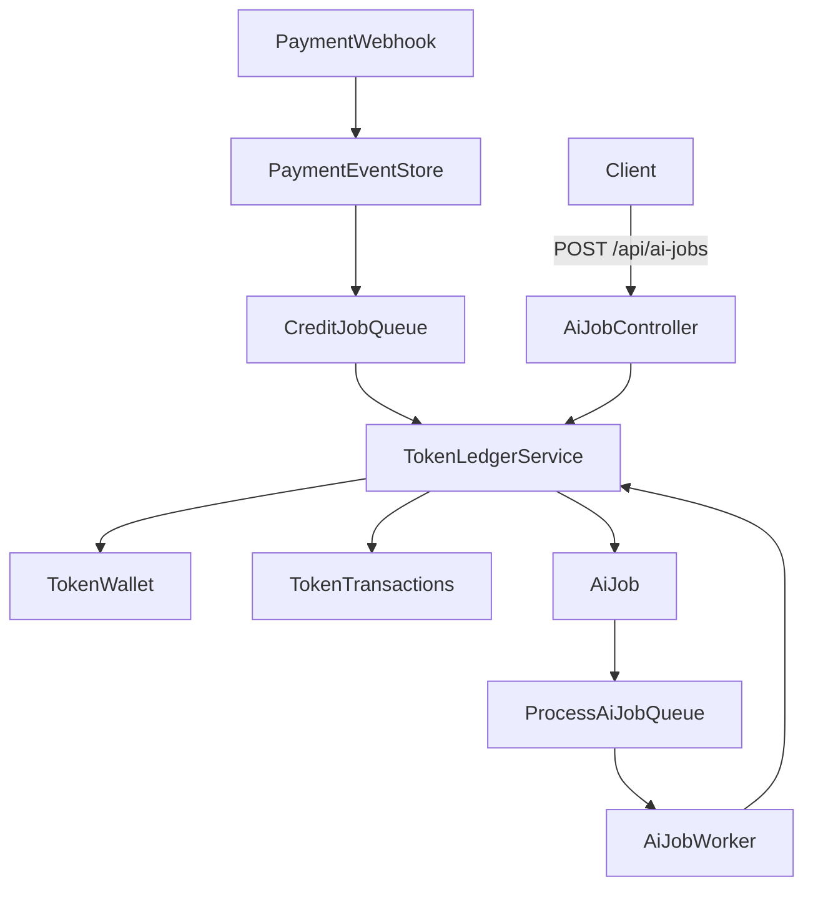

# ADR-0003: Token reservations + AI job processing

## Status

Accepted.

## Context

- Payments are recorded in the **central DB**; tokens live in **tenant pool DBs**.
- Webhooks can retry and must remain **idempotent**.
- AI jobs should be billed using tokens with **pre-checks** and **safe reservation** to avoid double spending.
- The system uses **1 user = 1 tenant**, with pooled tenant databases and dynamic routing.

## Decision

### Token ledger responsibilities

- Use a dedicated **TokenLedgerService** to centralize token changes:
  - `creditFromPayment()` for webhook credits (idempotent by `provider_transaction_id`).
  - `reserveForJob()` to check balance and reserve tokens for AI jobs.
  - `consumeForJob()` to finalize job costs.
  - `refundForJob()` to return tokens on failures.
- Token reservations **decrease wallet balance** immediately to prevent overspend.
- Idempotency is enforced by:
  - `token_transactions` uniqueness by `(tenant_id, provider_transaction_id)`
  - `token_transactions` uniqueness by `(tenant_id, job_id, type)`
  - `ai_jobs` uniqueness by `(tenant_id, idempotency_key)`

### AI job workflow

1. Client submits `POST /api/ai-jobs` (tenant domain).
2. Server validates `idempotency_key` and `effect_id`.
3. Tokens are **reserved** before job creation is finalized.
4. Job is enqueued for async processing.
5. Worker processes the job and either:
   - `consumeForJob()` on success, or
   - `refundForJob()` on failure.

### Webhook workflow updates

- Store webhook events in **central** `payment_events` (unique `provider_event_id`).
- Verify signatures when a secret is configured.
- Dispatch a **CreditTokensForPayment** job to avoid long webhook execution.

## Consequences

- Token changes are **atomic** and **auditable** via `token_transactions`.
- AI job requests are safe under retries and concurrency.
- Webhook processing becomes resilient and faster via async jobs.

## Flow diagram

## Implementation pointers

- Webhook handler: `backend/app/Http/Controllers/Webhook/PaymentWebhookController.php`
- Token ledger: `backend/app/Services/TokenLedgerService.php`
- AI jobs: `backend/app/Models/AiJob.php`, `backend/app/Jobs/ProcessAiJob.php`
- Tenant migration: `backend/database/migrations/tenant/2026_01_28_100011_create_ai_jobs_table.php`
- Token transactions migration: `backend/database/migrations/tenant/2026_01_28_100012_add_job_id_to_token_transactions_table.php`
- Central payment events: `backend/database/migrations/2026_01_28_000003_create_payment_events_table.php`
