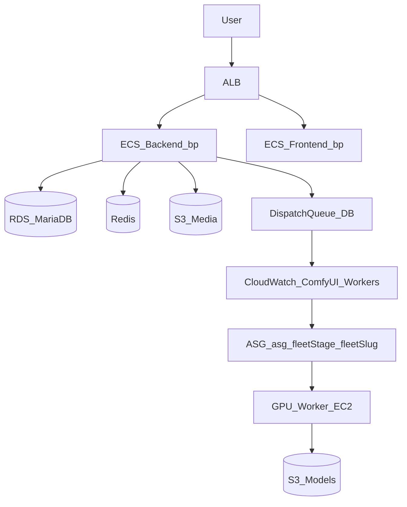

# Day-1 Operator Guide (AWS CDK)

Beginner-friendly runbook for deploying and operating the current AWS setup.

## Architecture model (important)

This repo now uses a **single core system**:

- `bp-cicd`
- `bp-network`
- `bp-data`
- `bp-compute`
- `bp-monitoring`
- `bp-gpu-shared`

Fleet stage exists only for GPU fleets and worker routing:

- `fleet_stage=staging`
- `fleet_stage=production`

Per-fleet stacks are named:

- `bp-gpu-fleet-<fleet_stage>-<fleet_slug>`

## Glossary (AWS basics used here)

- **VPC**: Private AWS network.
- **Subnet**: Network segment. We use public/private/isolated.
- **Security Group (SG)**: Virtual firewall.
- **ALB**: Routes `/api/*` to backend and `/*` to frontend.
- **ECS/Fargate**: Runs app containers.
- **ECR**: Stores backend/frontend container images.
- **RDS**: MariaDB database.
- **ElastiCache**: Redis.
- **S3**: Media/models/log object storage.
- **CloudFront**: CDN for media bucket.
- **ASG**: Auto Scaling Group for GPU workers.
- **CloudWatch/SNS/Lambda**: Metrics, alerts, and scale-to-zero automation.

## Architecture at a glance



## How fleet stacks launch GPU instances

Each fleet stack corresponds to one ASG:

- Stack: `bp-gpu-fleet-<fleet_stage>-<fleet_slug>`
- ASG: `asg-<fleet_stage>-<fleet_slug>`
- Launch template: `lt-<fleet_stage>-<fleet_slug>`

Runtime pointers:

- AMI: `/bp/ami/fleets/<fleet_stage>/<fleet_slug>`
- Desired config: `/bp/fleets/<fleet_stage>/<fleet_slug>/desired_config`
- Active bundle: `/bp/fleets/<fleet_stage>/<fleet_slug>/active_bundle`
- Fleet secret: `/bp/fleets/<fleet_stage>/fleet-secret`

## Day-1 checklist (first deploy)

1. **Bootstrap CDK** (once per account/region):
   - `npx cdk bootstrap`
2. **Deploy core stacks** (order matters):
   - `bp-cicd` → `bp-network` → `bp-data` → `bp-compute` → `bp-monitoring` → `bp-gpu-shared`
3. **Build/push app images**:
   - Run GitHub Actions `Deploy` (`.github/workflows/deploy.yml`) or push manually to `bp-backend`/`bp-frontend`.
4. **Set required secrets**:
   - `/bp/laravel/app-key`
   - `/bp/oauth/secrets` (if social auth is used)
   - `/bp/fleets/staging/fleet-secret`
   - `/bp/fleets/production/fleet-secret`
5. **Run migrations**:
   - `DB Migrate` workflow (`.github/workflows/db-migrate.yml`)
6. **Verify app health**:
   - ECS services healthy in cluster `bp`
   - `/api/up` returns 200
   - logs in `/ecs/bp-backend` and `/ecs/bp-frontend`

## Day-1 checklist (GPU bring-up)

For each fleet you need:

1. Create fleet in Admin UI with `fleet_stage`, `fleet_slug`, template, and instance type.
2. Run `provision-gpu-fleet.yml` with explicit `fleet_stage`.
3. Build/bake AMI:
   - `build-ami.yml`
   - `bake-ami.yml`
4. Refresh ASG and verify workers register.

## Daily operations

- **Deploy app code**
  - Run `Deploy` workflow; it builds/pushes images and redeploys ECS services.
- **Run DB changes**
  - Run `DB Migrate`; use `DB Seed` only when needed.
- **Manage fleet capacity**
  - Update fleet config in Admin UI and apply/provision via workflows.
- **Rotate secrets**
  - Use `infrastructure/scripts/sync-env-to-aws.ps1` and redeploy backend.

## Monitoring and troubleshooting

### First checks during incidents

- ALB 5xx alarms + target health
- RDS CPU and storage
- Fleet `QueueDepth` vs `ActiveWorkers`
- ECS service events in cluster `bp`

### Key log groups

- `/ecs/bp-backend`
- `/ecs/bp-frontend`
- `/gpu-workers/<fleet-slug>`

### Common failure modes

- **Workers not registering**:
  - Wrong/missing `/bp/fleets/<fleet_stage>/fleet-secret`
  - Backend unreachable from worker
- **AMI not found**:
  - Missing `/bp/ami/fleets/<fleet_stage>/<fleet_slug>`
- **No scale-out**:
  - Fleet metrics not publishing
  - Wrong stage/slug dimensions in alarms
- **ECS deploy failures**:
  - Missing ECR tags in `bp-backend`/`bp-frontend`

## Useful commands

```bash
# ECS service state
aws ecs describe-services \
  --cluster bp \
  --services bp-backend bp-frontend \
  --query "services[].{name:serviceName,running:runningCount,desired:desiredCount}" \
  --output table

# Tail logs
aws logs tail /ecs/bp-backend --follow
aws logs tail /ecs/bp-frontend --follow

# Fleet stack list
aws cloudformation list-stacks \
  --stack-status-filter CREATE_COMPLETE UPDATE_COMPLETE UPDATE_ROLLBACK_COMPLETE \
  --query "StackSummaries[?starts_with(StackName, 'bp-gpu-fleet-')].StackName" \
  --output table
```

## Shutdown

### Graceful scale-down

1. Set ECS desired count to 0 for `bp-backend` and `bp-frontend`.
2. Set each fleet ASG (`asg-<fleet_stage>-<fleet_slug>`) min/max/desired to 0.
3. Confirm no running ECS tasks and no running fleet instances.

### Full teardown

Use:

- `docs/recreate-infrastructure.md` for standard rebuild
- `docs/aws-full-reset-single-system.md` for full destructive reset (including retained data and bootstrap)
