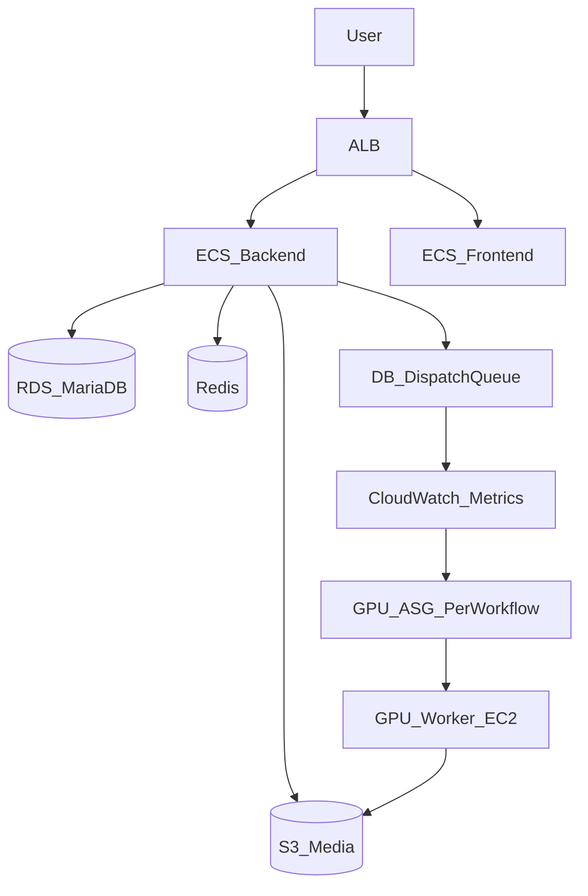

# Day-1 Operator Guide (AWS CDK)

Beginner-friendly runbook for deploying and operating the AI Product Manager infrastructure.

## Glossary (AWS basics used here)

- **VPC**: A private network in AWS. Everything runs inside it.
- **Subnet**: A smaller network inside a VPC. We use:
  - **Public** (internet‑facing ALB, NAT)
  - **Private** (ECS services, GPU workers)
  - **Isolated** (RDS/Redis, no internet)
- **Security Group (SG)**: Virtual firewall. Controls inbound/outbound network access.
- **ALB**: Application Load Balancer. Routes `/api/*` to backend, everything else to frontend.
- **ECS / Fargate**: Runs containers without managing servers.
- **ECR**: Docker image registry for ECS containers.
- **RDS**: Managed relational database (MariaDB here).
- **Redis**: In‑memory cache (ElastiCache).
- **S3**: Object storage for uploads and outputs.
- **CloudFront**: CDN for faster delivery of S3 media.
- **ASG**: Auto Scaling Group that launches EC2 GPU instances.
- **Launch Template**: The “recipe” for EC2 instances (AMI, instance type, user‑data, disk).
- **Spot**: Discounted EC2 pricing with interruptions.
- **CloudWatch**: Logs, metrics, alarms, and dashboards.
- **SNS**: Simple Notification Service (email alerts).

## Architecture at a glance



## How `workflows.ts` launches GPU instances

### The key idea

Each entry in `WORKFLOWS[]` becomes **one Auto Scaling Group (ASG)**:

- `slug: image-to-video` → ASG name `asg-<stage>-image-to-video`
- Each ASG launches GPU EC2 instances using the **AMI** listed in `amiSsmParameter`

### Mapping fields to AWS behavior

From `infrastructure/lib/config/workflows.ts`:

- **`slug`**: Used in ASG name, tags, and CloudWatch metric dimension `WorkflowSlug=<slug>`.
- **`displayName`**: Only affects dashboard labels (no behavior change).
- **`amiSsmParameter` / `amiId`**: The GPU AMI the instances boot from.
- **`instanceTypes`**: Which GPU instance types the ASG may launch (Spot).
- **`maxSize`**: Hard cap on how many GPU instances can run.
- **`warmupSeconds`**: How long a new instance has to boot before it counts as “ready.”
- **`scaleToZeroMinutes`**: Time with empty queue before the ASG is set to 0.
- **`backlogTarget`**: Conceptual target; scaling thresholds are currently hard-coded in `workflow-asg.ts`.

### Where the scaling metrics come from

The backend publishes metrics every minute (scheduler):

- `QueueDepth` = queued + leased jobs for a workflow
- `BacklogPerInstance` = QueueDepth / ActiveWorkers

These metrics are pushed to CloudWatch and drive ASG scaling.

### What “job” means here (not an AWS job)

In this project, a “job” is an **application AI task** stored in the database, not an AWS Batch/SQS job.
Jobs are created when a user submits an effect and they appear in the central `ai_job_dispatches` table.

### Quick example

If `QueueDepth = 5` and `ActiveWorkers = 1`, then:

```
BacklogPerInstance = 5 / 1 = 5
```

That is “above target”, so the ASG scales out.

### Important limitation (current code)

The thresholds are **hard-coded** in `workflow-asg.ts`:

- Backlog ≤ 2 → no change
- Backlog > 2 → add +1
- Backlog > 5 → add +2

Changing `backlogTarget` in `workflows.ts` does **not** change these thresholds yet.

## Day-1 operator checklist (first deploy)

1. **Bootstrap CDK (first time per account/region)**  
   `npx cdk bootstrap`
2. **Deploy stacks (order matters)**  
   `bp-<stage>-cicd` → `network` → `data` → `compute` → `gpu` → `monitoring`
3. **Build/push container images** (or rely on CI)
4. **Set required secrets**
   - `/bp/<stage>/laravel/app-key` (Secrets Manager)
   - `/bp/<stage>/fleet-secret` (SSM)
   - `/bp/<stage>/oauth/secrets` (optional)
5. **Run migrations**
   - Central: `php artisan migrate --force`
   - Pools: `php artisan tenancy:pools-migrate --force`
6. **Verify**
   - ALB targets healthy
   - ECS services stable
   - RDS reachable
   - CloudWatch dashboard exists
   - GPU ASGs exist

## Day-1 operator checklist (daily ops)

- **Deploy app code**
  - CI builds/pushes images
  - `aws ecs update-service --force-new-deployment`
- **Build new GPU AMI**
  - Run `build-ami.yml` (writes `/bp/ami/<slug>`)
  - Roll out by restarting ASG instances (instance refresh or scale-in/out)
- **Add a new workflow**
  - Add entry to `workflows.ts`
  - Build AMI and update SSM `/bp/ami/<slug>`
  - Deploy GPU stack: `npx cdk deploy bp-<stage>-gpu`

## How the infrastructure is wired (simple walkthrough)

1. **NetworkStack** creates the private network (VPC), subnets, NAT, and security groups.
2. **DataStack** creates RDS, Redis, S3 buckets, CloudFront, and secrets.
3. **ComputeStack** creates ECS Fargate services and the ALB that routes traffic.
4. **GpuWorkerStack** creates one ASG per workflow (from `WORKFLOWS`).
5. **MonitoringStack** creates dashboards, alarms, and alerts.
6. **CiCdStack** creates ECR repositories for container images.

These stacks are deployed in order so that later stacks can reference outputs from earlier ones.

## Monitoring and troubleshooting

### What to check first

- ALB 5xx alarms + target health
- RDS CPU + FreeStorageSpace
- QueueDepth vs ActiveWorkers (per workflow)
- NAT port allocation errors (if uploads/downloads fail)

### Key log groups

- `/ecs/bp-backend-<stage>`
- `/ecs/bp-frontend-<stage>`
- `/gpu-workers/<workflow-slug>`

### Common failure modes

- **Workers not registering**: fleet secret missing or wrong; backend API not reachable.
- **Metrics not publishing**: `workers:publish-metrics` not running or failing.
- **AMI missing**: `/bp/ami/<slug>` not found or wrong region.
- **Spot capacity**: no Spot capacity for chosen instance types.

## Shutdown

### Graceful scale-down

1. Set ECS desired count to 0
2. Set GPU ASG min/max/desired to 0
3. Verify no running tasks/instances

### Full teardown

- `npx cdk destroy` (reverse order)
- Production: RDS deletion protection and S3 retention require manual steps
